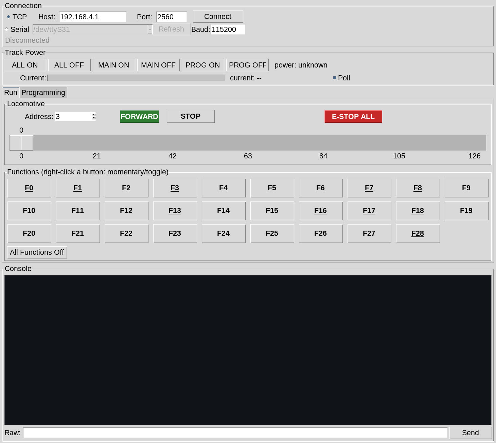
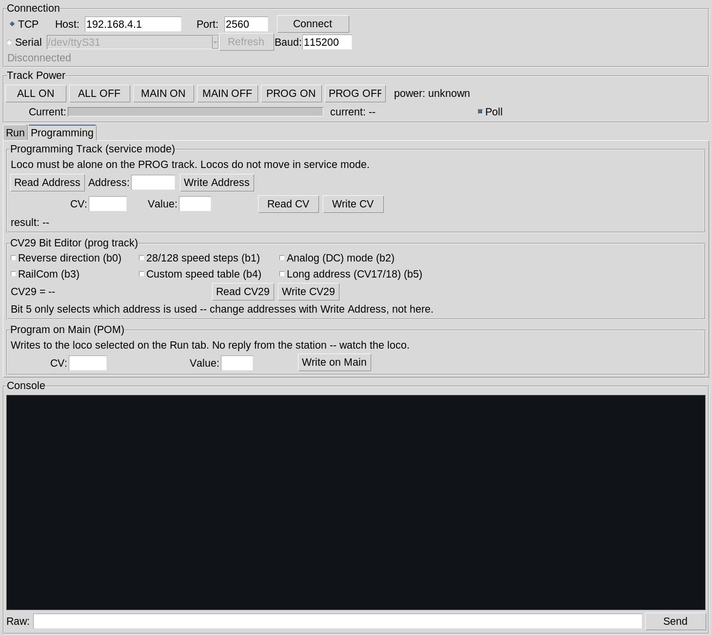

# DCC-EX Native Throttle

> **Development branch — untested.** This branch carries work in progress
> (multi-locomotive tabs with per-loco Setup, function labels and layouts)
> that has **not** been run against real command-station hardware. Expect
> rough edges. For the released, tested version use the `main` branch or
> the [GitHub releases](https://github.com/RB211/DCC_Ex_Driver/releases).

A self-hosted GUI throttle for [DCC-EX](https://dcc-ex.com/) command stations.
It speaks the **DCC-EX native command protocol** directly to an
EX-CommandStation over TCP or USB serial — no phone apps, no JMRI, no
WiThrottle bridge, no subscriptions. One Python file, stdlib only
(pyserial is optional, for the serial connection), running entirely on your
own network.



## What it does

- **Drives locomotives**: 126-step speed slider, colour-coded
  forward/reverse toggle, per-loco STOP and layout-wide **E-STOP ALL**.
- **Function keys F0–F28**, each button individually switchable between
  *momentary* (on while held — horns, whistles) and *toggle* (one press
  flips the state — lights, sound enable). Right-click a button to flip its
  mode; the choice is remembered in `~/.config/dccex-throttle.json`.
- **Programs decoders**: service-mode address and CV read/write on the PROG
  track, a CV29 bit editor, and Program-on-Main (POM) writes — with a
  built-in CV name lookup so results read as "CV 3 (Acceleration rate) = 24".
- **Track power control** per district (MAIN / PROG / both) plus a live
  current bar polled from the station, scaled against the software
  circuit-breaker trip point, with overload latching.
- **Stays in sync with the layout.** The DCC-EX protocol broadcasts every
  loco change to every connected client, so if another throttle (or an
  EXRAIL script) changes speed, direction, or functions, this one follows
  in real time.
- **Console** showing all traffic, plus a raw command box — type `D CABS`
  or any native command and it goes to the station verbatim.

## Requirements

- Python 3 with tkinter (any recent version; Tk 8.6+ on Linux, Tk 9 on macOS
  — Apple's bundled Tk 8.5 renders at the wrong scale).
- [pyserial](https://pypi.org/project/pyserial/) only if you want the USB
  serial connection; without it the Serial option simply disables itself.
- A DCC-EX EX-CommandStation (developed against an EX-CSB1, works with any
  station speaking the native protocol on port 2560).

Prebuilt one-file binaries for Linux x86_64 and macOS (Apple Silicon) are on
the [releases page](https://github.com/RB211/DCC_Ex_Driver/releases). The
macOS app is unsigned — first launch needs right-click → Open.

## Running from source

```sh
python3 -m venv .venv
.venv/bin/pip install pyserial     # optional, for serial support
.venv/bin/python dccex_throttle.py
```

## Connecting

**WiFi (TCP)** — a factory EX-CommandStation boots as an access point; the
SSID (`DCCEX_xxxxxx`) and password are shown on its OLED. Join that network
and the defaults already in the app (`192.168.4.1`, port `2560`) are
correct — just press **Connect**. If you've moved the station onto your
home network with EX-Installer, enter its IP instead.

**USB serial** — select Serial, pick the port (Refresh rescans), 115200
baud.

On connect the app sends `<s>`, logs the station's version banner, and
requests the current state of the selected loco so the controls match
reality before you touch anything.

## Running trains

1. Turn on track power — **ALL ON**, or **MAIN ON** if you want the
   programming track left off.
2. Enter the loco address (3 is the factory default for most decoders,
   and what the app starts on). Typing an address and pressing Enter, or
   using the arrows, immediately syncs the controls to that loco's actual
   state.
3. Drag the slider for speed, click the **FORWARD/REVERSE** button to
   change direction (green = forward, orange = reverse).
4. Click function buttons for lights and sounds. Underlined buttons are in
   toggle mode; the rest are momentary. Right-click any button to switch
   its mode. A green border shows which functions are currently on —
   driven by the station's broadcasts, so it's the decoder's real state,
   not just what was last clicked.
5. **STOP** halts the selected loco; **E-STOP ALL** emergency-stops every
   loco on the layout.

Closing the window drops track power.

## Programming CVs



The **Programming** tab has three sections:

**Programming Track (service mode)** — put the loco *alone* on the PROG
track and turn on PROG power. **Read Address** / **Write Address** handle
the cab number — the command station takes care of the CV1/CV17/CV18/CV29
juggling behind long addresses. **Read CV** / **Write CV** work on any
CV 1–1024; a successful
read fills the Value field, so read–modify–write is two clicks and an
edit. Entries are validated before anything is sent, and known CVs are
named beside the entry as you type.

**CV29 Bit Editor** — the six configuration bits that matter for a loco
decoder (direction, 28/128 steps, analog mode, RailCom, speed table, long
address) as checkboxes. **Read CV29** loads the current value; tick what
you want and **Write CV29** writes it back. Bits 6–7 are preserved from the
last read, so a write can't accidentally reflag the decoder. Nothing is
sent until you press Write.

**Program on Main (POM)** — writes a CV to the loco currently selected on
the Run tab, on the main track, while it's running. DCC-EX sends no reply
for POM writes; watch the loco (this is the way to tweak momentum, volume,
or lighting CVs live).

## Notes

- The station is polled for track current once a second while the **Poll**
  box is ticked; unticking it stops the polling entirely.
- Power state shows *unknown* until the station reports it — the protocol
  has no way to ask, so the app doesn't pretend to know.
- Speed maxes at 126, which is the real ceiling of the DCC 128-step mode
  (steps 0 and 1 are stop and e-stop).

## Building a standalone binary

```sh
.venv/bin/pip install pyinstaller
.venv/bin/pyinstaller --onefile --windowed --name dccex-throttle dccex_throttle.py
```

The result lands in `dist/`. On macOS, ship the generated `.app` bundle,
zipped with `ditto -c -k --keepParent` (plain `zip` strips bundle
metadata).
